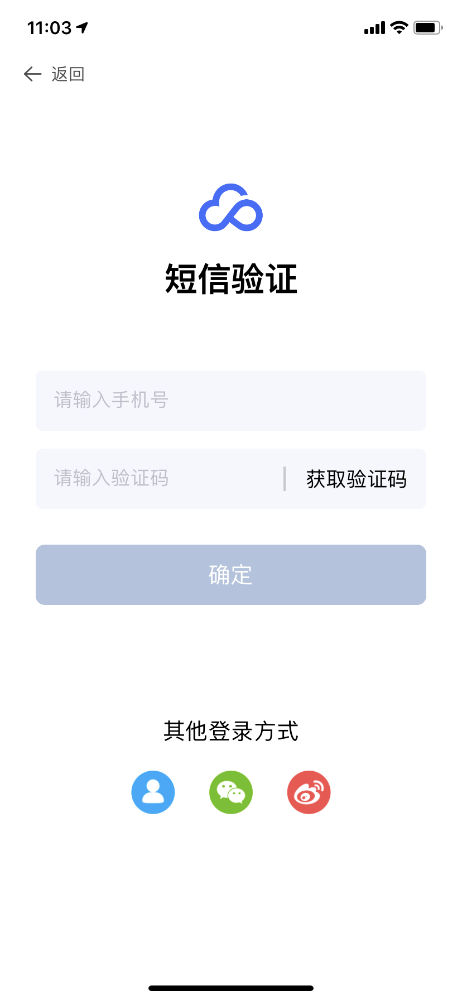
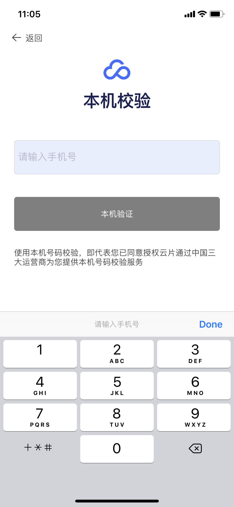

# <center>云片 移动认证 SDK接入文档</center>

## 一、一键登录

一键登录是云片提供的 APP 身份验证产品。整合三大运营商的手机号网关验证服务，可以替代 APP 上的注册、登录等场景需要使用到的短信验证码，优化 APP 用户在移动设备上的使用体验。

***
## 1.集成流程

### 1.1 获取应用 AppId

  * 访问[云片官网](https://www.yunpian.com/entry?method=register)进行注册账号，联系客服或者销售申请开通移动认证服务。

  * 成功开通服务后，进入[管理控制台](https://www.yunpian.com/admin/main)，进入移动认证的产品管理页面。

  * 选择**新增应用**，填写应用名称以及 BundleId，系统会为该产品分配 **AppId**，应用进入审核状态，并联系客服进行审核，等待审核完成。


### 1.2. 集成客户端 SDK

客户端 SDK 支持 **Android**、**iOS** 两大平台，涉及到网站主的两个 API 请求以及与服务端的几个 API 请求。客户端 SDK 的业务使用流程为：

  * 调用初始化接口，初始化一键登录 SDK。

  * 调用一键登录接口，完成一键登录，将成功回调的 cid 返回给开发者自己的服务端。

### 1.3. 从接口获取校验结果(开发者服务端)

开发者服务端从客户端请求解析到相关参数后，接口能正确返回校验结果，即代表集成成功。

<mark>注意：SDK要求iOS版本为8.0及以上！</mark>

***

## 2. Xcode 添加 一键登录 SDK

### pod 方式添加库
```
pod 'YPOneLogin'
```
### 手动添加一键登录 SDK
### 2.1. 导入YPOneLogin的库和资源
导⼊SDK目录下的文件，其中主要接⼝在 YPOneLogin.framework 中，其他framework为运营商的框架。


### 2.2. 导入必要的依赖库
导入系统的两个库：libz.1.2.8.tbd、libc++.1.tbd


### 2.3. setting设置设置 Other Linker Flags
找到主工程的 target -> Build Setting -> Linking -> Other Linker Flags,将其设置为 -ObjC ,
如果项目仍有问题，可以再添加-all_load:


## 3. SDK API 说明

### 3.1 初始化启动接口

**接口说明：**

SDK单例入口，获取一键登录权限,可以在本接⼝的成功回调中，调用预取号接⼝。
```Objc
/**
 启动 SDK
 
 @param appId 后台分配的 appId
 @param completion 初始化完成回调
 */
+ (void)startWithAppId:(NSString *)appId  completion:(void(^)
(NSDictionary * _Nullable result))completion;
```
**接口示例:**

```Objc
    [YPOneLogin startWithAppId:@"" 
    completion:^(NSDictionary * _Nullable result) 
    {
        if ([result[@"status"]integerValue] == 200) 
        {
            //成功

        }else{
        }
    }];
```
**回调数据示例：**
```java

//成功 返回格式
{
    msg = success;
    status = 200;
}
//失败 返回格式
{
    msg = "Error Domain=YunpianErrorDomain 
    Code=404 \"(null)\" 
    UserInfo={msg=\U5e94\U7528\U4e0d\U5b58\U5728, code=40402}";
    status = 404;
}
```
### 3.2 预取号接口

**接口说明：**

可以提前获知当前用户的手机网络环境是否符合一键登录的使用条件，成功后将得到用于一键登录使用的临时凭证，默认的凭证 有效期: 60 分钟(移动) / 60 分钟(电信) / 10 分钟(联通)

```Objc
/**
 预取号接口（注意：需要初始化完成后调用本接口）

 @param completion 预取号接口回调
 */
+ (void)preGetTokenWithCompletion:(void(^)(NSDictionary *sender))completion;
```
**接口示例：**

```Objc
- (void)viewDidLoad {
    [super viewDidLoad];
    [YPOneLogin preGetTokenWithCompletion:
            ^(NSDictionary *_Nonnull sender){}];
}
```
**回调数据示例：**
```java
//成功 返回格式
{
    accessCode = nm940130850df64c01955412c5674e8781;
    cid = 41a164f85ddb48eec9204b2e64c4e500;//服务器流水号
    msg = success;//信息描述
    number = "189****9794";//手机掩码
    operatorType = CT;//运营商类型CT电信、CU联通、CM移动
    status = 200;//状态码,成功失败以状态码为准
}
//错误 返回格式
{
   status = 500;
   operatorType = CT;
   errorCode = -30003,
   msg = "\U83b7\U53d6accessCode\U6210\U529f";
}
```
### 3.3 获取登录token

**接口说明：**

请求一键登录验证，在回调中获取 cid，并上传至开发者⾃自己的服务器进⾏校验，获取完整手机号，viewController传入
当前窗口的VC对象即可，viewModel为自定义授权页界面属性。

 **注意:**
调⽤用本接口前，需要提前调⽤ preGetTokenWithCompletion: 接⼝.

```Objc
/**
 请求一键登录验证

 @param viewController 调用一键登录的界面
 @param viewModel      界面自定义模型
 @param completion     一键登录回调
 */
+ (void)requestTokenWithViewController:
(UIViewController *)viewController 
viewModel:(nullable OLAuthViewModel *)viewModel 
completion:(void(^)(NSDictionary * _Nullable result))completion;
```
**接口示例：**

```Objc
    [YPOneLogin requestTokenWithViewController:weakSelf viewModel:
    self->olAuthViewModel 
    completion:^(NSDictionary * _Nullable result) {

       //开发者服务器校验

    }];
```
**回调数据示例：**
```java
//成功 返回格式
{
    cid = 3e3cc7fd5ddb6976c9204b2e64c4e505;
    errorCode = 0;
    msg = success;
    number = "189****9794";
    operatorType = CT;
    status = 200;
}
//错误 返回格式
{
   status = 20005;
   msg = "\U83b7\U53d6accessCode\U6210\U529f";
}
```
### 3.4 手动取消授权页

**接口说明：**

如果采用非授权页取消方式（如返回按钮、切换按钮、登录按钮），自定义取消方式需要调用此接口。

```Objc
/**
 手动取消授权页
 
 * @param isAnimal 是否添加动画；默认是YES
 * @param complete 完成回调
 */
+ (void)cancelAuthViewController:(BOOL)isAnimal Complete:
(void(^__nullable)(void))complete;
```
**接口示例**

```Objc
[YPOneLogin cancelAuthViewController:YES Complete:^{  }];
```

### 3.5 设置请求超时时长

**接口说明：**

设置请求超时时长,最多等待时长，默认是5秒

```Objc
/**
 设置请求超时时长

 @param timeout 单位为s，默认为5s
*/
+ (void)setRequestTimeout:(NSTimeInterval)timeout;
```
**接口示例**

```Objc
[YPOneLogin setRequestTimeout:10];
```

### 3.6 判断预取号结果是否有效

**接口说明：**

判断预取号结果是否有效

```Objc
/**
 判断预取号结果是否有效
 *
 * @return YES: 预取号结果有效, NO: 预取号结果无效；注意：需加载进度条，等待预取号完成之后拉起授权页面
 */
+ (BOOL)isPreGetTokenValid;

```


### 3.7 短信验证

**接口说明：**

利用短信验证码验证，带界面，可通过修改viewModel定义界面。

```Objc
/**
 短信校验验证界面（注意：调用本接口前要提前调用预取号接口）
 
 @param viewController          调用短信校验的界面
 @param viewModel               界面自定义模型
 @param sendSmsCompletion       发送短信回调
 @param codeVerfiySmsCompletion 验证校验码回调
 */
+ (void)requestSmsTokenWithViewController:(UIViewController *)viewController 
viewModel:(nullable YPOneLoginSmsViewModel *)viewModel 
sendSmsCompletion:(void(^)(NSDictionary * _Nullable result))sendSmsCompletion 
codeVerfiySmsCompletion:(void(^)(NSDictionary * _Nullable result))
codeVerfiySmsCompletion;
```
**接口示例**

```Objc
 
[YPOneLogin requestSmsTokenWithViewController:self viewModel:nil 
sendSmsCompletion:^(NSDictionary * _Nullable result) {

} codeVerfiySmsCompletion:^(NSDictionary * _Nullable result) { 
    
}];
```
**回调数据示例：**
```java
//成功 返回格式
{
    cid = 3d76ca995ddb6e32c9204b2e64c4e50f;
    msg = success;
    status = 200;
}
//错误 返回格式
{
    msg = "\U77ed\U4fe1\U6821\U9a8c\U672a\U901a\U8fc7";
    status = 40008;
}
```

### 3.8 短信验证（无界面），获取验证码

**接口说明：**

利用短信验证码验证，纯接口调用，根据手机号，向手机发送验证码。

```Objc
/**
 发送短信接口，用于自定义实现短信校验功能

 @param phoneNumber   手机号
 @param callback      验证接口回调
 */
- (void)requestSmsVerifyWithPhoneNumber:(NSString *)
phoneNumber withCallback:(void (^)(NSDictionary *sender)
)callback;
```
**接口示例**

```Objc

[_manager requestSmsVerifyWithPhoneNumber:_pnTF.text 
withCallback:^(NSDictionary * _Nonnull sender) {
      //手机将获取验证码
    }];
}
```
**回调数据示例：**
```java
//成功 返回格式
{
    cid = b4c48a385ddba537c9204b2e64c4e562;
    msg = success;
    status = 200;
}
//错误 返回格式
{
    msg = "\U77ed\U4fe1\U53d1\U9001\U5931\U8d25";
    status = 40009;
}
```

### 3.9 短信验证（无界面），校验验证码

**接口说明：**

利用短信验证码验证，纯接口调用，检测验证码是否正确。

```Objc
/**
 校验验证码接口，用于自定义实现短信校验功能

 @param code     短信验证码
 @param callback 验证接口回调
 */
- (void)smsVerifyCode:(NSString *)code withCallback:
(void (^)(NSDictionary *sender))callback;
```
**接口示例**

```Objc
[_manager smsVerifyCode:@"xxxxx" withCallback:^
(NSDictionary * _Nonnull sender) {
 }];
```
**回调数据示例：**
```java
//成功 返回格式
{
    cid = b4c48a385ddba537c9204b2e64c4e562;
    msg = success;
    status = 200;
}
//错误 返回格式
{
    msg = "\U65e0\U6548\U7684\U4f1a\U8bddID";
    status = 40005;
}
```

### 3.10 SDK版本号

**接口说明：**

获取当前SDK的版本号。

```Objc
/**
 SDK 版本号

 @return SDK 版本
 */
+ (NSString *)sdkVersion;
```
**接口示例**

```Objc
[YPOneLogin sdkVersion];
```

### 3.11 开启或关闭打印

**接口说明：**

开启或关闭打印,上线时注意关掉，测试的时候可以打开调试

```Objc
/**
 开启或关闭打印

 * @param isEnabled 是否开启打印，默认是关闭打印
 */
+ (void)setLogEnabled:(BOOL)isEnabled;

```
**接口示例**

```Objc
[YPOneLogin setLogEnabled:NO];
```

***

## 4.状态码释义

| 响应码 | 具体描述 |
| ----  | ------ |
| 200   | 成功 |
| 500 | 连接超时。失败 |
| 20000 | 初始化 SDK 失败 |
| 20001 | 未知错误 |
| 20002 | AppId 不能为空，请检查是否初始化 SDK |
| 20003 | submit token error |
| 20004 | 预取号 cid 为空 |
| 66661 | 点击返回按钮 |
| 66662 | 点击切换按钮 |
| -40101   | 移动运营商预取号失败 |
| -40201 | 联通运营商预取号失败 |
| -40301 | 电信运营商预取号失败 |
| -40102 | 移动运营商取号失败 |
| -40202 | 联通运营商取号失败 |
| -40302 | 电信运营商取号失败 |


***

## 5. 自定义UI
```Objc
#pragma mark - Status Bar/状态栏

/**
 状态栏样式。 默认 `UIStatusBarStyleDefault`。
 */
@property (nonatomic, assign) UIStatusBarStyle statusBarStyle;

#pragma mark - Navigation/导航

/**
 授权页导航的标题。默认为空字符串。
 */
@property (nullable, nonatomic, strong) NSAttributedString *naviTitle;

/**
 授权页导航的背景颜色。默认白色。
 */
@property (nullable, nonatomic, strong) UIColor *naviBgColor;

/**
 授权页导航左边的返回按钮的图片。默认黑色系统样式返回图片。
 */
@property (nullable, nonatomic, strong) UIImage *naviBackImage;

/**
 授权页导航右边的自定义控件。
 */
@property (nullable, nonatomic, strong) UIView *naviRightControl;

/**
 导航栏隐藏。默认不隐藏。
 */
@property (nonatomic, assign) BOOL naviHidden;

/**
 返回按钮位置及大小，返回按钮最大size为CGSizeMake(40, 40)。
 */
@property (nonatomic, assign) OLRect backButtonRect;

/**
 返回按钮隐藏。默认不隐藏。
 */
@property (nonatomic, assign) BOOL backButtonHidden;

/**
 * 点击授权页面返回按钮的回调
 */
@property (nullable, nonatomic, copy) OLClickBackButtonBlock clickBackButtonBlock;

#pragma mark - Logo/图标

/**
 授权页面上展示的图标。默认为 "OneLogin" 图标。
 */
@property (nullable, nonatomic, strong) UIImage *appLogo;

/**
 Logo 位置及大小。
 */
@property (nonatomic, assign) OLRect logoRect;

/**
 Logo 图片隐藏。默认不隐藏。
 */
@property (nonatomic, assign) BOOL logoHidden;

/**
 logo圆角，默认为0。
 */
@property (nonatomic, assign) CGFloat logoCornerRadius;

#pragma mark - Phone Number Preview/手机号预览

/**
 号码预览文字的颜色。默认黑色。
 */
@property (nullable, nonatomic, strong) UIColor *phoneNumColor;

/**
 号码预览文字的字体。默认粗体，24pt。
 */
@property (nullable, nonatomic, strong) UIFont *phoneNumFont;

/**
 号码预览 位置及大小，电话号码不支持设置大小，大小根据电话号码文字自适应
 */
@property (nonatomic, assign) OLRect phoneNumRect;

#pragma mark - Switch Button/切换按钮

/**
 授权页切换账号按钮的文案。默认为“切换账号”。
 */
@property (nullable, nonatomic, copy) NSString *switchButtonText;

/**
 授权页切换账号按钮的颜色。默认蓝色。
 */
@property (nullable, nonatomic, strong) UIColor *switchButtonColor;

/**
 授权页切换账号按钮背景颜色。默认为 nil。
 */
@property (nullable, nonatomic, strong) UIColor *switchButtonBackgroundColor;

/**
 授权页切换账号的字体。默认字体，15pt。
 */
@property (nullable, nonatomic, strong) UIFont *switchButtonFont;

/**
 授权页切换账号按钮 位置及大小。
 */
@property (nonatomic, assign) OLRect switchButtonRect;

/**
 隐藏切换账号按钮。默认不隐藏。
 */
@property (nonatomic, assign) BOOL switchButtonHidden;

/**
 * 点击授权页面切换账号按钮的回调
 */
@property (nullable, nonatomic, copy) OLClickSwitchButtonBlock clickSwitchButtonBlock;

#pragma mark - Authorization Button/认证按钮

/**
 授权页认证按钮的背景图片, @[正常状态的背景图片, 不可用状态的背景图片, 高亮状态的背景图片]。默认正常状态为蓝色纯色, 不可用状态的背景图片时为灰色, 高亮状态为灰蓝色。
 */
@property (nullable, nonatomic, strong) NSArray<UIImage *> *authButtonImages;

/**
 授权按钮文案。默认白色的"一键登录"。
 */
@property (nullable, nonatomic, strong) NSAttributedString *authButtonTitle;

/**
 授权按钮 位置及大小。
 */
@property (nonatomic, assign) OLRect authButtonRect;

/**
 授权按钮圆角，默认为0。
 */
@property (nonatomic, assign) CGFloat authButtonCornerRadius;

/**
 * 点击授权页面授权按钮的回调，用于监听授权页面登录按钮的点击
 */
@property (nullable, nonatomic, copy) OLClickAuthButtonBlock clickAuthButtonBlock;

/**
 * 自定义授权页面登录按钮点击事件，用于完全接管授权页面点击事件，当返回 YES 时，可以在 block 中添加自定义操作
 */
@property (nullable, nonatomic, copy) OLCustomAuthActionBlock customAuthActionBlock;

#pragma mark - Slogan/口号标语

/**
 Slogan 位置及大小。
 */
@property (nonatomic, assign) OLRect sloganRect;

/**
 Slogan 文字颜色。默认灰色。
 */
@property (nonatomic, strong) UIColor *sloganTextColor;

/**
 Slogan字体。默认字体, 12pt。
 */
@property (nonatomic, strong) UIFont *sloganTextFont;

#pragma mark - CheckBox & Privacy Terms/隐私条款勾选框及隐私条款

/**
 授权页面上条款勾选框初始状态。默认 YES。
 */
@property (nonatomic, assign) BOOL defaultCheckBoxState;

/**
 授权页面上勾选框勾选的图标。默认为蓝色图标。推荐尺寸为12x12。
 */
@property (nullable, nonatomic, strong) UIImage *checkedImage;

/**
 授权页面上勾选框未勾选的图标。默认为白色图标。推荐尺寸为12x12。
 */
@property (nullable, nonatomic, strong) UIImage *uncheckedImage;

/**
 授权页面上条款勾选框大小。
 */
@property (nonatomic, assign) CGSize checkBoxSize __attribute__((deprecated("use checkBoxRect instead.")));

/**
 授权页面上条款勾选框大小及位置。
 */
@property (nonatomic, assign) OLRect checkBoxRect;

/**
 隐私条款文字属性。默认基础文字灰色, 条款蓝色高亮, 12pt。
 */
@property (nullable, nonatomic, strong) NSDictionary<NSAttributedStringKey, id> *privacyTermsAttributes;

/**
 额外的条款。默认为空。
 */
@property (nullable, nonatomic, strong) NSArray<OLPrivacyTermItem *> *additionalPrivacyTerms;

/**
 服务条款普通文字的颜色。默认灰色。
 */
@property (nullable, nonatomic, strong) UIColor *termTextColor;

/**
 隐私条款 位置及大小，隐私条款，宽需大于50，高需大于20，才会生效。
 */
@property (nonatomic, assign) OLRect termsRect;

/**
 除隐私条款外的其他文案，数组大小必须为4，元素依次为：条款前的文案、条款一和条款二连接符、条款二和条款三连接符，条款后的文案。
 默认为@[@"登录即同意", @"和", @"、", @"并使用本机号码登录"]
 */
@property (nullable, nonatomic, copy) NSArray<NSString *> *auxiliaryPrivacyWords;

/**
 * 点击授权页面隐私协议前勾选框的回调
 */
@property (nullable, nonatomic, copy) OLClickCheckboxBlock clickCheckboxBlock;

/**
 * 服务条款文案对齐方式，默认为NSTextAlignmentLeft
 */
@property (nonatomic, assign) NSTextAlignment termsAlignment;

/**
 * 点击授权页面运营商隐私协议的回调
 */
@property (nullable, nonatomic, copy) OLViewPrivacyTermItemBlock carrierTermItemBlock;

/**
 * 是否在运营商协议名称上加书名号《》
 */
@property (nonatomic, assign) BOOL hasQuotationMarkOnCarrierProtocol;

#pragma mark - Custom Area/自定义区域

/**
 自定义区域视图的处理block
 
 @discussion
 提供的视图容器使用NSLayoutConstraint与相关的视图进行布局约束。
 如果导航栏没有隐藏, 顶部与导航栏底部对齐, 左边与屏幕左边对齐, 右边与屏幕右边对齐, 底部与屏幕底部对齐。
 如果导航栏隐藏, 顶部与状态栏底部对齐, 左边与屏幕左边对齐, 右边与屏幕右边对齐, 底部与屏幕底部对齐。
 */
@property (nullable, nonatomic, copy) OLCustomUIHandler customUIHandler;

/**
 * 授权页面旋转时的回调，可在该回调中修改自定义视图的frame，以适应新的布局
 */
@property (nullable, nonatomic, copy) OLAuthVCTransitionBlock authVCTransitionBlock;

#pragma mark - Background Image/授权页面背景图片

/**
 授权页背景颜色。默认白色。
 */
@property (nullable, nonatomic, strong) UIColor *backgroundColor;

/**
 授权页面背景图片
 */
@property (nullable, nonatomic, strong) UIImage *backgroundImage;

/**
 横屏模式授权页面背景图片
 */
@property (nullable, nonatomic, strong) UIImage *landscapeBackgroundImage;


#pragma mark - orientationMask

/**
 * 授权页面支持的横竖屏方向
 */
@property (nonatomic, assign) UIInterfaceOrientationMask supportedInterfaceOrientations;


#pragma mark - Popup

/**
 * 是否为弹窗模式
 */
@property (nonatomic, assign) BOOL isPopup;

/**
 弹窗 位置及大小。弹窗模式时，x轴偏移只支持portraitLeftXOffset和landscapeLeftXOffset。
 */
@property (nonatomic, assign) OLRect popupRect;

/**
 弹窗圆角，默认为6。
 */
@property (nonatomic, assign) CGFloat popupCornerRadius;

/**
 当只需要设置弹窗的部分圆角时，通过popupCornerRadius设置圆角大小，通过popupRectCorners设置需要设置圆角的位置。
 popupRectCorners数组元素不超过四个，超过四个时，只取前四个。比如，要设置左上和右上为圆角，则传值：@[@(UIRectCornerTopLeft), @(UIRectCornerTopRight)]
 */
@property (nonatomic, strong) NSArray<NSNumber *> *popupRectCorners;

/**
 * 弹窗动画类型，当popupAnimationStyle为OLAuthPopupAnimationStyleStyleCustom时，动画为用户自定义，用户需要传一个CATransition对象来设置动画
 */
@property (nonatomic, assign) OLAuthPopupAnimationStyle popupAnimationStyle;

/**
 * 弹窗自定义动画
 */
@property (nonatomic, strong) CAAnimation *popupTransitionAnimation;

/**
 弹窗关闭按钮图片，弹窗关闭按钮的尺寸跟图片尺寸保持一致。
 弹窗关闭按钮位于弹窗右上角，目前只支持设置其距顶部偏移和距右边偏移。
 */
@property (nullable, nonatomic, strong) UIImage *closePopupImage;

/**
 弹窗关闭按钮距弹窗顶部偏移。
 */
@property (nonatomic, strong) NSNumber *closePopupTopOffset;

/**
 弹窗关闭按钮距弹窗右边偏移。
 */
@property (nonatomic, strong) NSNumber *closePopupRightOffset;

/**
是否需要通过点击弹窗的背景区域以关闭授权页面。
*/
@property (nonatomic, assign) BOOL canClosePopupFromTapGesture;

/**
* 点击授权页面弹窗背景的回调
*/
@property (nonatomic, copy) OLTapAuthBackgroundBlock tapAuthBackgroundBlock;


#pragma mark - WebViewController Navigation/服务条款页面导航栏

/**
 服务条款页面导航栏隐藏。默认不隐藏。
 */
@property (nonatomic, assign) BOOL webNaviHidden;

/**
 服务条款页面导航栏的标题，默认与协议名称保持一致，粗体、17pt。
 设置后，自定义协议的文案、颜色、字体都与设置的值保持一致，
 运营商协议的颜色、字体与设置的值保持一致，文案不变，与运营商协议名称保持一致。
 */
@property (nullable, nonatomic, strong) NSAttributedString *webNaviTitle;

/**
 服务条款页面导航的背景颜色。默认白色。
 */
@property (nullable, nonatomic, strong) UIColor *webNaviBgColor;

#pragma mark - Hint

/**
 未勾选服务条款复选框时，点击登录按钮的提示。默认为"请同意服务条款"。
 */
@property (nullable, nonatomic, copy) NSString *notCheckProtocolHint;

#pragma mark - OLAuthViewLifeCycleBlock

/**
 授权页面视图生命周期回调。
 */
@property (nullable, nonatomic, copy) OLAuthViewLifeCycleBlock viewLifeCycleBlock;

#pragma mark - UIModalPresentationStyle

/**
 present授权页面时的样式，默认为UIModalPresentationFullScreen
 */
@property (nonatomic, assign) UIModalPresentationStyle modalPresentationStyle;

/**
 * present授权页面时的自定义动画
 */
@property (nonatomic, strong) CAAnimation *modalPresentationAnimation;

/**
 * dismiss授权页面时的自定义动画
 */
@property (nonatomic, strong) CAAnimation *modalDismissAnimation;

#pragma mark - OLPullAuthVCStyle

/**
 * @abstract 进入授权页面的方式，默认为 modal 方式，即 present 到授权页面，从授权页面进入服务条款页面的方式与此保持一致
 */
@property (nonatomic, assign) OLPullAuthVCStyle pullAuthVCStyle;

```

***

## 6. 效果演示

### 一键登录：


### 短信验证：



### 具体demo样式，请在苹果商店搜索`云片一键登录`；

***

## 二、号码校验
号码校验是云片提供的 APP 身份验证产品。整合三大运营商的手机号网关验证服务，可以替代 APP 上的注册、登录等场景需要使用到的短信验证码，
优化 APP 用户在移动设备上的使用体验。

***
## 1和2 集成流程（同一键登录）
和一键登录为同一SDK，不需重复导入；接口在YPOnePass.h中；

***

## 3. SDK API 说明

### 3.1 初始化启动接口

**接口说明：**

初始化YPOnePass对象，作为上下文。
```Objc
/**
 初始化接口
 
 @param appId   云片appId
 @param timeout 超时时间
 @return        类实例对象
 */
- (instancetype)initWithAppId:(NSString *)appId timeout:
(NSTimeInterval)timeout;

```
**接口示例:**

```Objc
 _manager = [[YPOnePass alloc] 
 initWithAppId:@"" 
 timeout:10];
```
### 3.2 本机号码校验接口

**接口说明：**

针对输入的号码进行本机校验；
```Objc
/**
 本机号码校验接口
 
 @param phoneNum 待验证手机号
 @param success  成功回调
 @param fail     失败回调
 */
- (void)verifyPhoneNumber:(NSString *)phoneNum 
onSuccess:(void (^)(NSDictionary *dicInfo))success 
onFail:(void (^)(NSDictionary *dicInfo))fail;
```
**接口示例:**

```Objc
[_manager verifyPhoneNumber:_pnTF.text onSuccess:^
(NSDictionary *_Nonnull dicInfo) {

}onFail:^(NSDictionary *_Nonnull dicInfo) {

}];
```
**回调数据示例：**
```java
//成功 返回格式,注意这里并不代表验证成功
{
    cid = b77b22ce5ddb9c0bc9204b2e64c4e55c;
}
//失败 返回格式
{
    cid = 1bf5121f5ddba1c6c9204b2e64c4e561;
    msg = "{\n    
    NSLocalizedDescription = 
    \"Invalid Phone Number. OnePass only supports 
    China Mobile/China Telecom/China Unicom etc.\";\n}";
    status = 500;
}
```

### 3.3 短信验证（带界面）

**接口说明：**

利用短信验证码验证，带界面，可通过修改viewModel定义界面。

```Objc
/**
 短信校验验证界面（注意：调用本接口前要提前调用预取号接口）
 
 @param viewController          调用短信校验的界面
 @param viewModel               界面自定义模型
 @param sendSmsCompletion       发送短信回调
 @param codeVerfiySmsCompletion 验证校验码回调
 */
- (void)requestSmsTokenWithViewController:(UIViewController *)viewController 
viewModel:(nullable YPOnePassSmsViewModel *)viewModel 
sendSmsCompletion:(void(^)(NSDictionary * _Nullable result))sendSmsCompletion 
codeVerfiySmsCompletion:(void(^)(NSDictionary * _Nullable result))
codeVerfiySmsCompletion;
```
**接口示例**

```Objc
 
[_manager requestSmsTokenWithViewController:self viewModel:nil 
sendSmsCompletion:^(NSDictionary * _Nullable result) {

} codeVerfiySmsCompletion:^(NSDictionary * _Nullable result) { 
    
}];
```
**回调数据示例：**
```java
//成功 返回格式
{
    cid = 3d76ca995ddb6e32c9204b2e64c4e50f;
    msg = success;
    status = 200;
}
//错误 返回格式
{
    msg = "\U77ed\U4fe1\U6821\U9a8c\U672a\U901a\U8fc7";
    status = 40008;
}
```

### 3.4 短信验证，获取验证码

**接口说明：**

利用短信验证码验证，纯接口调用，根据手机号，向手机发送验证码。

```Objc
/**
 发送短信接口，用于自定义实现短信校验功能

 @param phoneNumber   手机号
 @param callback      验证接口回调
 */
- (void)requestSmsVerifyWithPhoneNumber:(NSString *)
phoneNumber withCallback:(void (^)(NSDictionary *sender)
)callback;
```
**接口示例**

```Objc

[_manager requestSmsVerifyWithPhoneNumber:_pnTF.text 
withCallback:^(NSDictionary * _Nonnull sender) {
      //手机将获取验证码
    }];
}
```
**回调数据示例：**
```java
//成功 返回格式
{
    cid = b4c48a385ddba537c9204b2e64c4e562;
    msg = success;
    status = 200;
}
//错误 返回格式
{
    msg = "\U77ed\U4fe1\U53d1\U9001\U5931\U8d25";
    status = 40009;
}
```

### 3.5 短信验证，校验验证码

**接口说明：**

利用短信验证码验证，纯接口调用，检测验证码是否正确。

```Objc
/**
 校验验证码接口，用于自定义实现短信校验功能

 @param code     短信验证码
 @param callback 验证接口回调
 */
- (void)smsVerifyCode:(NSString *)code withCallback:
(void (^)(NSDictionary *sender))callback;
```
**接口示例**

```Objc
[_manager smsVerifyCode:@"xxxxx" withCallback:^
(NSDictionary * _Nonnull sender) {
 }];
```
**回调数据示例：**
```java
//成功 返回格式
{
    cid = b4c48a385ddba537c9204b2e64c4e562;
    msg = success;
    status = 200;
}
//错误 返回格式
{
    msg = "\U65e0\U6548\U7684\U4f1a\U8bddID";
    status = 40005;
}
```
***

## 4.状态码释义

| 响应码 | 具体描述 |
| ----  | ------ |
| 200   | 成功 |
| 500 | 连接超时。失败 |
| 20000 | 初始化 SDK 失败 |
| 20001 | 未知错误 |
| 20002 | AppId 不能为空，请检查是否初始化 SDK |
| 20003 | submit token error |
| -20301   | 手机号不可用 |
| -20302 | 网络不支持 |
| -20303 | 运营商不支持 |
| -40101 | 移动获取 token 失败 |
| -40104 | 移动不支持的网络 |
| -40201 | 联通获取 token 失败 |
| -40301 | 电信获取 token 失败 |
| -40302 | 电信返回结果解析失败 |
| -40304 | 电信不支持的网络 |
| -49900 | 未知错误 |


***

## 5. 效果演示

### 本机号码校验：

