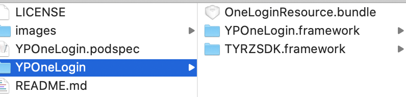
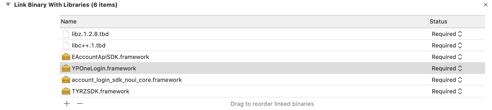
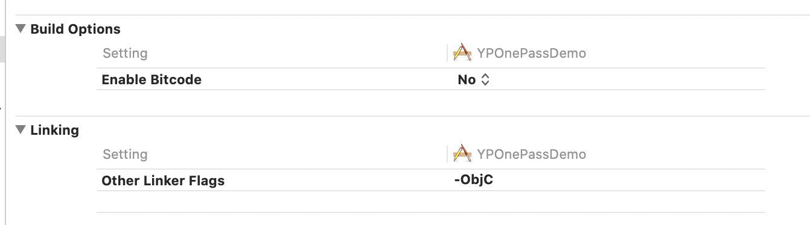
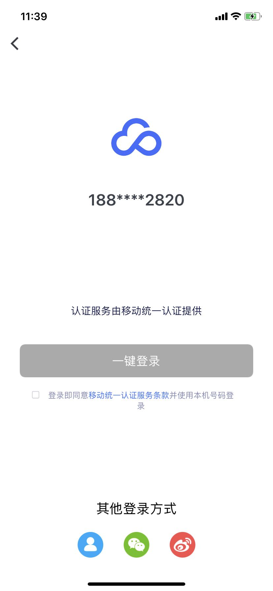

# <center>云片 一键登录iOS SDK接入文档</center>

一键登录是云片提供的 APP 身份验证产品。整合三大运营商的手机号网关验证服务，可以替代 APP 上的注册、登录等场景需要使用到的短信验证码，优化 APP 用户在移动设备上的使用体验。

***
## 1.集成流程

### 1.1 获取应用 AppId

  * 访问[云片官网](https://www.yunpian.com/entry?method=register)进行注册账号，联系客服或者销售申请开通移动认证服务。

  * 成功开通服务后，进入[管理控制台](https://www.yunpian.com/admin/main)，进入移动认证的产品管理页面。

  * 选择**新增应用**，填写应用名称以及 BundleId，系统会为该产品分配 **AppId**，应用进入审核状态，并联系客服进行审核，等待审核完成。


### 1.2. 集成客户端 SDK

客户端 SDK 支持 **Android**、**iOS** 两大平台，涉及到网站主的两个 API 请求以及与服务端的几个 API 请求。客户端 SDK 的业务使用流程为：

  * 调用初始化接口，初始化一键登录 SDK。

  * 在初始化接口的回调中，调用预取号接口。

  * 调用一键登录接口，完成一键登录，将成功回调的 cid 返回给开发者自己的服务端。

### 1.3. 从接口获取校验结果(开发者服务端)

开发者服务端从客户端请求解析到相关参数后，接口能正确返回校验结果，即代表集成成功。

<mark>注意：SDK要求iOS版本为8.0及以上！</mark>

***

## 2. Xcode 添加 一键登录 SDK

### 2.1. 解压压缩包
其中SDK文件夹中为需要接入的工程的框架文件，Demo工程中为演示样例。

### 2.2. 添加一键登录 SDK
导⼊SDK目录下的文件，其中主要接⼝在 YPOneLogin.framework 中，其他framework为运营商的框架。


### 2.3. 导入必要的依赖库
导入系统的两个库：libz.1.2.8.tbd、libc++.1.tbd


### 2.4. setting设置设置 Other Linker Flags
找到主工程的 target -> Build Setting -> Linking -> Other Linker Flags,将其设置为 -ObjC ,
如果项目仍有问题，可以再添加-all_load:



## 3. SDK API 说明

### 3.1 初始化启动接口

**接口说明：**

SDK单例入口，获取一键登录权限,可以在本接⼝的成功回调中，调用预取号接⼝。
```Objc
/**
 启动 SDK
 
 @param appId 后台分配的 appId
 @param completion 初始化完成回调
 */
+ (void)startWithAppId:(NSString *)appId  completion:(void(^)
(NSDictionary * _Nullable result))completion;
```
**接口示例:**

```Objc
    [YPOneLogin startWithAppId:@"98b482fc9efa45ddb141e6fd8804cb01" 
    completion:^(NSDictionary * _Nullable result) 
    {
        if ([result[@"status"]integerValue] == 200) 
        {
            //成功

        }else{
        }
    }];
```
**回调数据示例：**
```java

//成功 返回格式
{
    msg = success;
    status = 200;
}
//失败 返回格式
{
    msg = "Error Domain=YunpianErrorDomain 
    Code=404 \"(null)\" 
    UserInfo={msg=\U5e94\U7528\U4e0d\U5b58\U5728, code=40402}";
    status = 404;
}
```
### 3.2 预取号接口

**接口说明：**

在一键登录前，需要调用预取号接口，才可以调⽤一键登录接⼝。

```Objc
/**
 预取号接口（注意：需要初始化完成后调用本接口）

 @param completion 预取号接口回调
 */
+ (void)preGetTokenWithCompletion:(void(^)(NSDictionary *sender))completion;
```
**接口示例：**

```Objc
- (void)viewDidLoad {
    [super viewDidLoad];
    [YPOneLogin startWithAppId:@"your appId"
             completion:^(NSDictionary *_Nullable result) {
        if ([result[@"status"] integerValue] == 200) {
            [YPOneLogin preGetTokenWithCompletion:
            ^(NSDictionary *_Nonnull sender){
            }]; } else {
                NSLog(@"初始化失败"); }
    }];
    [YPOneLogin setDelegate:self];
}
```
**回调数据示例：**
```java
//成功 返回格式
{
    accessCode = nm940130850df64c01955412c5674e8781;
    cid = 41a164f85ddb48eec9204b2e64c4e500;//服务器流水号
    msg = success;//信息描述
    number = "189****9794";//手机掩码
    operatorType = CT;//运营商类型CT电信、CU联通、CM移动
    status = 200;//状态码,成功失败以状态码为准
}
//错误 返回格式
{
   status = 500;
   operatorType = CT;
   errorCode = -30003,
   msg = "\U83b7\U53d6accessCode\U6210\U529f";
}
```
### 3.3 获取登录token

**接口说明：**

请求一键登录验证，在回调中获取 cid，并上传至开发者⾃自己的服务器进⾏校验，获取完整手机号，viewController传入
当前窗口的VC对象即可，viewModel为自定义授权页界面属性。

 **注意:**
调⽤用本接口前，需要提前调⽤ preGetTokenWithCompletion: 接⼝.

```Objc
/**
 请求一键登录验证

 @param viewController 调用一键登录的界面
 @param viewModel      界面自定义模型
 @param completion     一键登录回调
 */
+ (void)requestTokenWithViewController:
(UIViewController *)viewController 
viewModel:(nullable OLAuthViewModel *)viewModel 
completion:(void(^)(NSDictionary * _Nullable result))completion;
```
**接口示例：**

```Objc
    [YPOneLogin requestTokenWithViewController:weakSelf viewModel:
    self->olAuthViewModel 
    completion:^(NSDictionary * _Nullable result) {

       //开发者服务器校验

    }];
```
**回调数据示例：**
```java
//成功 返回格式
{
    cid = 3e3cc7fd5ddb6976c9204b2e64c4e505;
    errorCode = 0;
    msg = success;
    number = "189****9794";
    operatorType = CT;
    status = 200;
}
//错误 返回格式
{
   status = 20005;
   msg = "\U83b7\U53d6accessCode\U6210\U529f";
}
```
### 3.4 手动取消授权页

**接口说明：**

如果采用非授权页取消方式（如返回按钮、切换按钮、登录按钮），自定义取消方式需要调用此接口。

```Objc
/**
 手动取消授权页
 
 * @param isAnimal 是否添加动画；默认是YES
 * @param complete 完成回调
 */
+ (void)cancelAuthViewController:(BOOL)isAnimal Complete:
(void(^__nullable)(void))complete;
```
**接口示例**

```Objc
[YPOneLogin cancelAuthViewController:YES Complete:^{  }];
```
### 3.5 短信验证

**接口说明：**

利用短信验证码验证，带界面，可通过修改viewModel定义界面。

```Objc
/**
 短信校验验证界面（注意：调用本接口前要提前调用预取号接口）
 
 @param viewController          调用短信校验的界面
 @param viewModel               界面自定义模型
 @param sendSmsCompletion       发送短信回调
 @param codeVerfiySmsCompletion 验证校验码回调
 */
+ (void)requestSmsTokenWithViewController:(UIViewController *)viewController 
viewModel:(nullable YPOneLoginSmsViewModel *)viewModel 
sendSmsCompletion:(void(^)(NSDictionary * _Nullable result))sendSmsCompletion 
codeVerfiySmsCompletion:(void(^)(NSDictionary * _Nullable result))
codeVerfiySmsCompletion;
```
**接口示例**

```Objc
 
[YPOneLogin requestSmsTokenWithViewController:self viewModel:nil 
sendSmsCompletion:^(NSDictionary * _Nullable result) {

} codeVerfiySmsCompletion:^(NSDictionary * _Nullable result) { 
    
}];
```
**回调数据示例：**
```java
//成功 返回格式
{
    cid = 3d76ca995ddb6e32c9204b2e64c4e50f;
    msg = success;
    status = 200;
}
//错误 返回格式
{
    msg = "\U77ed\U4fe1\U6821\U9a8c\U672a\U901a\U8fc7";
    status = 40008;
}
```

### 3.6 短信验证（无界面），获取验证码

**接口说明：**

利用短信验证码验证，纯接口调用，根据手机号，向手机发送验证码。

```Objc
/**
 发送短信接口，用于自定义实现短信校验功能

 @param phoneNumber   手机号
 @param callback      验证接口回调
 */
- (void)requestSmsVerifyWithPhoneNumber:(NSString *)
phoneNumber withCallback:(void (^)(NSDictionary *sender)
)callback;
```
**接口示例**

```Objc

[_manager requestSmsVerifyWithPhoneNumber:_pnTF.text 
withCallback:^(NSDictionary * _Nonnull sender) {
      //手机将获取验证码
    }];
}
```
**回调数据示例：**
```java
//成功 返回格式
{
    cid = b4c48a385ddba537c9204b2e64c4e562;
    msg = success;
    status = 200;
}
//错误 返回格式
{
    msg = "\U77ed\U4fe1\U53d1\U9001\U5931\U8d25";
    status = 40009;
}
```

### 3.7 短信验证（无界面），校验验证码

**接口说明：**

利用短信验证码验证，纯接口调用，检测验证码是否正确。

```Objc
/**
 校验验证码接口，用于自定义实现短信校验功能

 @param code     短信验证码
 @param callback 验证接口回调
 */
- (void)smsVerifyCode:(NSString *)code withCallback:
(void (^)(NSDictionary *sender))callback;
```
**接口示例**

```Objc
[_manager smsVerifyCode:@"xxxxx" withCallback:^
(NSDictionary * _Nonnull sender) {
 }];
```
**回调数据示例：**
```java
//成功 返回格式
{
    cid = b4c48a385ddba537c9204b2e64c4e562;
    msg = success;
    status = 200;
}
//错误 返回格式
{
    msg = "\U65e0\U6548\U7684\U4f1a\U8bddID";
    status = 40005;
}
```

### 3.8 SDK版本号

**接口说明：**

获取当前SDK的版本号。

```Objc
/**
 SDK 版本号

 @return SDK 版本
 */
+ (NSString *)sdkVersion;
```
**接口示例**

```Objc
[YPOneLogin sdkVersion];
```

***

## 4.状态码释义

| 响应码 | 具体描述 |
| ----  | ------ |
| 200   | 成功 |
| 500 | 连接超时。失败 |
| 20000 | 初始化 SDK 失败 |
| 20001 | 未知错误 |
| 20002 | AppId 不能为空，请检查是否初始化 SDK |
| 20003 | submit token error |
| 20004 | 预取号 cid 为空 |
| 20005 | Used accessCode. You should get a valid AccessCode by `preGetToken` method first. |

***

## 5. 效果演示

### 一键登录：



### 短信验证：


### 具体demo样式，请在苹果商店搜索`云片一键登录`；
